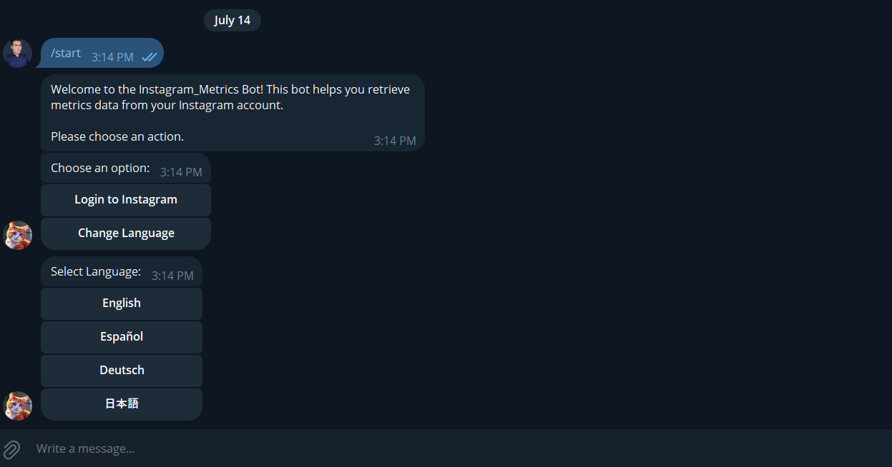
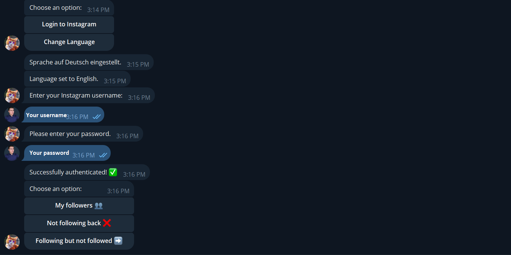
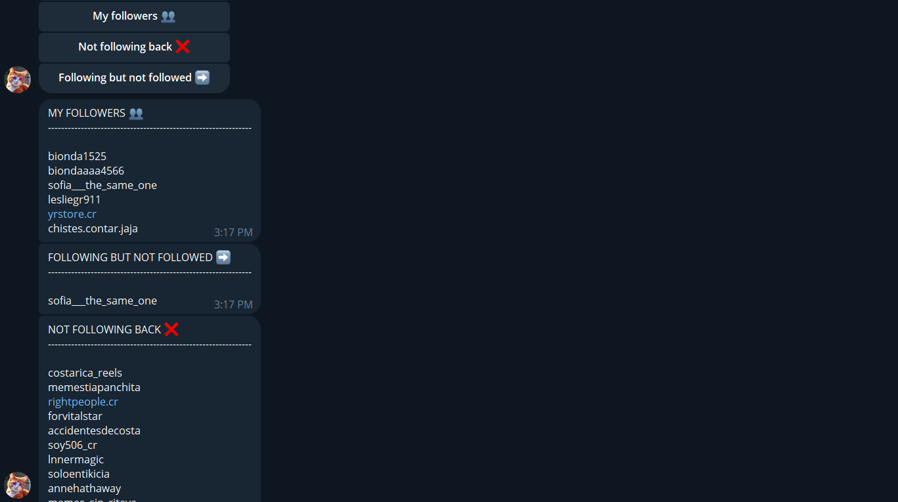

# Instagram Metrics Bot

The **Instagram Metrics Bot** is a Python-based Telegram bot designed to interact with Instagram through Instaloader. It allows users to log in to their Instagram account, view followers, users not following back, and followers not followed back. The bot provides a seamless interface using Telegram's interactive buttons for navigation and language selection.

## 1. Features:

### a. Bot Operation:

- Login to Instagram and handle 2FA authentication.
- View followers, users not following back, and followers not followed back.
- Change bot interface language (English, Español, Deutsch, 日本語).

### b. Setup:

- Clone the Repository
- Configure .env File
- Install Dependencies
- Running the Bot

## 2. Bot Operation:

### a. Initialization and Setup:

- The bot initializes with the /start command in Telegram.
- Requires a Telegram API token (`TELEGRAM_TOKEN`) and Instagram credentials in a .env file.

### b. Handling User Inputs:

- Users provide Instagram credentials and handle 2FA if required.
- Retrieves follower information and displays them using Telegram's inline buttons.

### c. Language Selection:

- Users can select from supported languages: English, Español, Deutsch, 日本語.
- Language selection persists throughout the session.

## 3. Setup

### a. Clone the Repository:

**bash**
        git clone https://github.com/netto14cr/Instagram_Telegram_Bot_04.git
        cd Instagram_Telegram_Bot_04

### b. Configure .env File:
- Create a .env file in the project root directory.
- Add your Telegram API token and Instagram credentials.

**env**
        TELEGRAM_TOKEN=your_telegram_token_here

### c. Install Dependencies:
**bash**
        python -m venv env
        source env/bin/activate  # For Linux/Mac
        .\env\Scripts\activate  # For Windows
        pip install -r requirements.txt

### d. Running the Bot:
        py instagram_metrics_bot.py

## 4. Example Usage

### Using the Bot

#### a. Starting the Bot

- Initiate the bot by sending the /start command in Telegram.

#### b. Logging in to Instagram

- Follow prompts to enter Instagram username and password.
- Handle 2FA authentication if required.

### c. Viewing Followers
- Navigate using inline buttons to view followers, users not following back, and followers not followed back.

## 5. Screenshots:

## 5. License:
*This bot is for educational purposes and uses Instaloader to interact with Instagram via Telegram.*